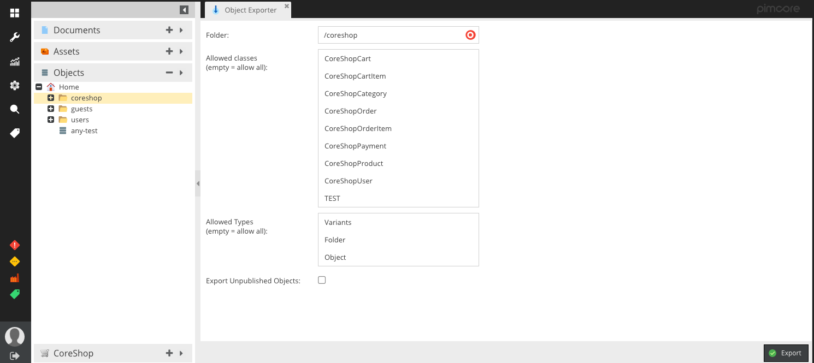
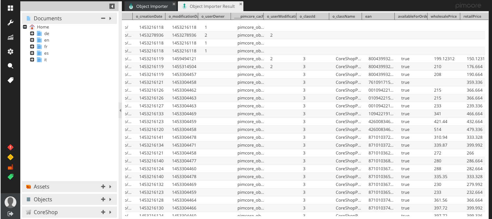

# Import Export Plugin for Pimcore
Import and Export Data Plugin for Pimcore Objects.

## Getting started

* Download Plugin and place it in your plugins directory
* Activate Plugin
* Reload Pimcore
* Export Objects
* Import Objects

## Screenshots

